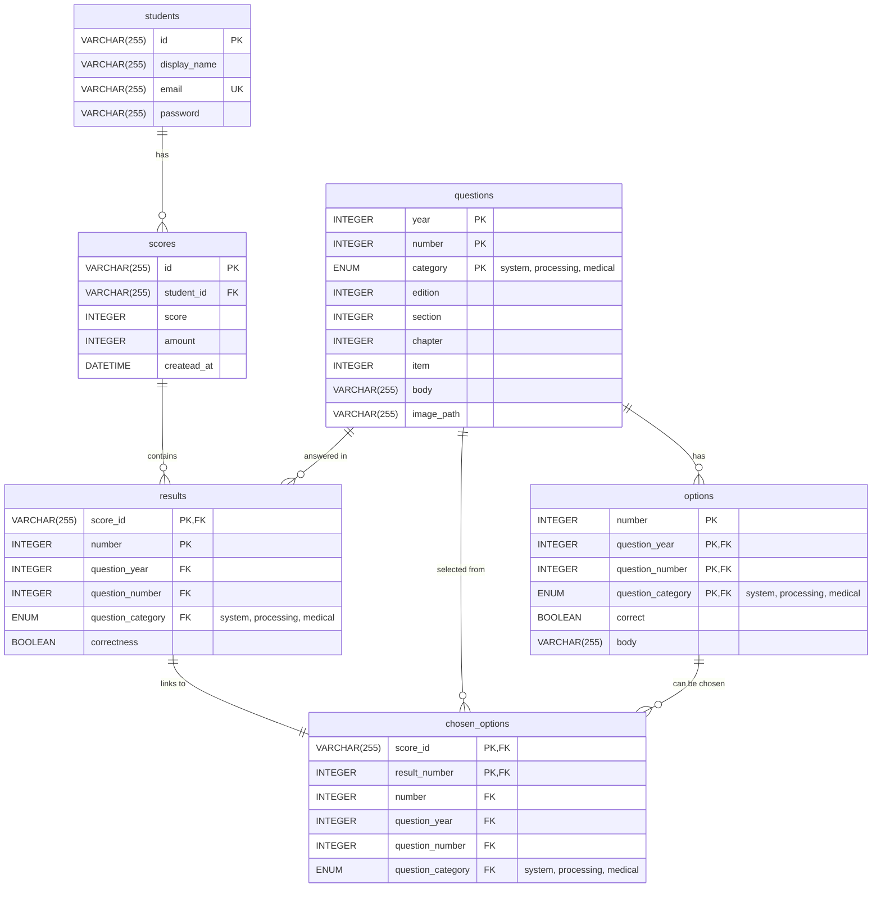

# データベース ER図

このファイルは zemi_app のデータベース構造を示すER図です。

## ER図

## テーブル説明

### students（学生）
- **id**: 学生の一意識別子
- **display_name**: 表示名
- **email**: メールアドレス（ユニーク）
- **password**: パスワード

### questions（問題）
- **year, number, category**: 複合主キー
- **category**: システム、処理、医療の3つのカテゴリ
- **edition, section, chapter, item**: 問題の階層構造
- **body**: 問題文
- **image_path**: 問題に関連する画像のパス

### options（選択肢）
- **number**: 選択肢番号
- **question_year, question_number, question_category**: 問題への外部キー
- **correct**: 正解フラグ
- **body**: 選択肢の内容

### scores（得点）
- **id**: 得点記録の一意識別子
- **student_id**: 学生への外部キー
- **score**: 得点
- **amount**: 問題数
- **createad_at**: 作成日時

### results（結果）
- **score_id, number**: 複合主キー
- **question_year, question_number, question_category**: 問題への外部キー
- **correctness**: 正解/不正解フラグ

### chosen_options（選択された選択肢）
- **score_id, result_number**: 複合主キー
- **number, question_year, question_number, question_category**: 選択肢と問題への外部キー

## システム概要

このデータベースは学習管理システムのもので、以下の機能をサポートしています：

1. **学生管理**: 学生の登録と認証
2. **問題管理**: カテゴリ別の問題とその選択肢
3. **試験実施**: 学生の回答記録と採点
4. **結果分析**: 個別問題ごとの正解率や学習履歴の追跡

学生が試験を受けると、`scores`テーブルに全体の得点が記録され、`results`テーブルに各問題の正解/不正解が、`chosen_options`テーブルに実際に選択した選択肢が記録される構造になっています。
